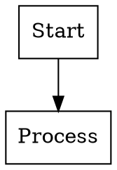
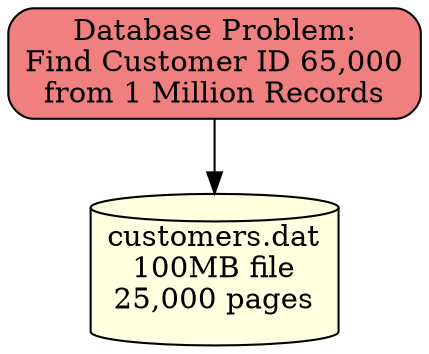

# Graphviz DOT Diagram Support

Your MADs (Multi-format Automated Documentation System) now supports **Graphviz DOT diagrams** alongside PlantUML diagrams! This enhancement gives you the best of both worlds for creating technical presentations.

## Overview

**Graphviz DOT** format is perfect for:
- Tree structures (B+Trees, decision trees, parse trees)
- Network diagrams (system architecture, data flow)
- Graph relationships (dependencies, state machines)
- Hierarchical layouts (organizational charts, class hierarchies)

**PlantUML** remains excellent for:
- Sequence diagrams (interactions over time)
- Activity diagrams (process flows)
- Class diagrams (object-oriented design)

## Quick Start

### 1. Create a DOT Diagram with Steps

Create a `.dot` file in `src/diagrams/` with step-by-step markers:



### 2. Reference in YAML Presentation

Use the same `diagramRef` syntax as PlantUML:

```yaml
- type: "diagram"
  title: "My Graph Example"
  diagramRef: "my_diagram"  # filename without .dot extension
  bullets:
    - "Shows step-by-step progression"
    - "Interactive navigation between steps"
```

### 3. Build

```bash
# Generate just DOT diagrams
./gradlew dotSvg    # SVG format
./gradlew dotPng    # PNG format

# Generate everything (includes DOT diagrams)
./gradlew html      # HTML presentations with SVG
./gradlew ppt       # PowerPoint with PNG
./gradlew all       # Everything
```

## Step Syntax

Use the same step syntax as PlantUML, but with DOT comment style:

```dot
// [step1 {"name":"Step Name"}]
// your DOT content here
// [/step1]

// [step2 {"name":"Next Step"}]
// your DOT content here
// [/step2]
```

## Features

### ✅ Step-by-Step Navigation
- Each step becomes a separate diagram
- Interactive navigation in HTML presentations
- Perfect for building up complex diagrams incrementally

### ✅ Multiple Output Formats
- **SVG**: Vector graphics for web presentations
- **PNG**: Raster graphics for PowerPoint exports

### ✅ Automatic Integration
- Works seamlessly with existing YAML presentation system
- Same `diagramRef` syntax as PlantUML
- Automatic discovery and processing

### ✅ Error Handling
- Checks for Graphviz installation
- Clear error messages if `dot` command not found
- Graceful fallback if diagrams can't be generated

## Installation Requirements

Install Graphviz on your system:

**macOS:**
```bash
brew install graphviz
```

**Ubuntu/Debian:**
```bash
sudo apt-get install graphviz
```

**Windows:**
Download from [graphviz.org](https://graphviz.org/download/)

**Verify Installation:**
```bash
dot -V
# Should output: dot - graphviz version X.Y.Z
```

## Example: B+Tree Visualization

Our example `simple_btree_example.dot` demonstrates Graphviz advantages:



**Benefits for B+Trees:**
- ✅ Natural tree layout algorithms
- ✅ Automatic node positioning
- ✅ Professional hierarchical appearance
- ✅ Easy to show search paths with colored edges

## Integration Details

### Build Process
1. **Discovery**: Finds all `.dot` files in `src/diagrams/`
2. **Parsing**: Extracts step markers using `DotStepParser`
3. **Generation**: Creates individual step files in `build/diagrams/`
4. **Processing**: Calls `dot` command for each step file
5. **Output**: Generates SVG/PNG files for HTML/PowerPoint

### File Structure
```
src/diagrams/
├── my_diagram.dot              # Source DOT file
└── other_diagram.puml          # PlantUML files work too

build/diagrams/
├── my_diagram/                 # DOT diagram output
│   ├── step1.dot              # Individual step file
│   ├── step1.svg              # Generated SVG
│   ├── step2.dot
│   └── step2.svg
└── other_diagram/             # PlantUML output
    ├── step1.puml
    └── step1.svg
```

## Advanced Features

### Custom Node Shapes and Styles
```dot
// Rich styling options
node [shape=record, style="rounded,filled"];
edge [color=blue, penwidth=2];

// Subgraphs for grouping
subgraph cluster_0 {
    label="Database Layer";
    style=filled;
    fillcolor=lightgray;
    A; B;
}
```

### Layout Algorithms
```dot
// Different layout directions
rankdir=TB;  // Top to Bottom
rankdir=LR;  // Left to Right
rankdir=BT;  // Bottom to Top
rankdir=RL;  // Right to Left

// Layout engines
// dot:    hierarchical (default)
// neato:  spring model
// fdp:    force-directed
// circo:  circular
// twopi:  radial
```

## Best Practices

### 1. Choose the Right Tool
- **DOT for structures**: Trees, networks, dependencies
- **PlantUML for processes**: Sequences, activities, use cases

### 2. Step Design
- Build complexity gradually across steps
- Highlight changes between steps using colors
- Keep each step focused on one concept

### 3. Styling
- Use consistent color schemes
- Leverage Graphviz's automatic layout
- Add meaningful labels and annotations

### 4. Performance
- DOT processing is fast for most diagrams
- Complex graphs (>1000 nodes) may need optimization
- SVG output scales better than PNG for large diagrams

## Troubleshooting

### "Graphviz not found" Error
```bash
# Check installation
dot -V

# Install if missing (macOS)
brew install graphviz

# Verify PATH
which dot
```

### Build Errors
```bash
# Clean build
./gradlew clean

# Verbose output
./gradlew dotSvg --info

# Check individual files
dot -Tsvg your_file.dot -o test.svg
```

### Syntax Errors
- Validate DOT syntax: [WebGraphviz](http://www.webgraphviz.com/)
- Check step marker format: `// [step1 {"name":"Name"}]`
- Ensure balanced brackets and quotes

## What's Next?

Your MADs system now provides comprehensive diagram support:

- ✅ **PlantUML**: Sequence/activity diagrams
- ✅ **Graphviz**: Tree/network diagrams  
- ✅ **JFreeChart**: Performance charts
- ✅ **Step Navigation**: Interactive presentations
- ✅ **Multi-format**: HTML and PowerPoint export

This makes your technical presentations more engaging and easier to understand! 