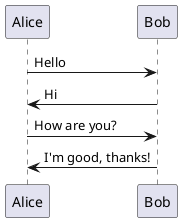

# PlantUMLSteps

This project automates the process of generating sequence diagrams from `.puml` files using PlantUML. It supports stepwise generation of diagrams, where each step builds upon the previous ones, and includes an interactive viewer for the generated diagrams.

## Features
- **Stepwise Diagram Generation**: Automatically splits `.puml` files based on step markers.
- **HTML Viewer**: Generates an `index.html` file for each diagram directory, enabling step-by-step navigation.
- **Reusable Style**: Automatically copies a `style.puml` file into the output directories for consistent styling.

## Project Structure
```
project/
├── build.gradle       # Gradle build script
├── plantuml.jar       # PlantUML jar file
├── src/
│   └── diagrams/         # Source directory for .puml files
│       ├── style.puml # Reusable style definitions
│       ├── diagram1.puml
│       └── diagram2.puml
├── build/             # Output directory
    └── diagrams/
        ├── diagram1/
        │   ├── step1.puml
        │   ├── step1.png
        │   ├── ...
        │   └── index.html
        └── diagram2/
            ├── ...
```

## How to Use

### 1. Add Your Diagrams
- Place your `.puml` files in the `src/diagrams` directory.
- Use step markers (`' [step1]` and `' [/step1]`) in your `.puml` files to define steps.

Example:


### 2. Generate Diagrams
Run the Gradle task:
```bash
gradle generateStepwiseDiagrams
```

This will:
- Generate `.puml` and `.png` files for each step.
- Create an `index.html` file in each diagram's output directory for interactive viewing.

### 3. Clean Build Directory
To clean the `build` directory, run:
```bash
gradle clean
```

### 4. View Diagrams
- Open the `build/diagrams/<diagram_name>/index.html` file in a browser to view the step-by-step diagrams.

## Customization

### Style
- Define your custom styles in `style.puml` and place it in the `src/diagrams` directory.

### HTML Viewer
- The generated `index.html` can be modified in the `DiagramGenerator` class.

